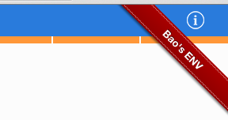
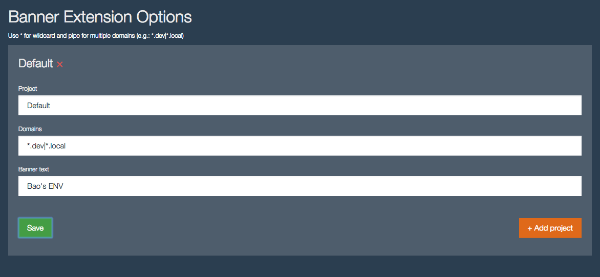

Banner for specific domains
======
Specify domains (e.g: `*.dev|*.local`) for the banner to appear:

Usage:
------
Drop `banner.crx` to your Chrome extensions page.  

Firefox version: [baopham/banner-firefox-addon](https://github.com/baopham/banner-firefox-addon)

Requirements:
-------------
Chrome

Install:
--------

License:
--------
MIT

Author:
-------
Bao Pham
